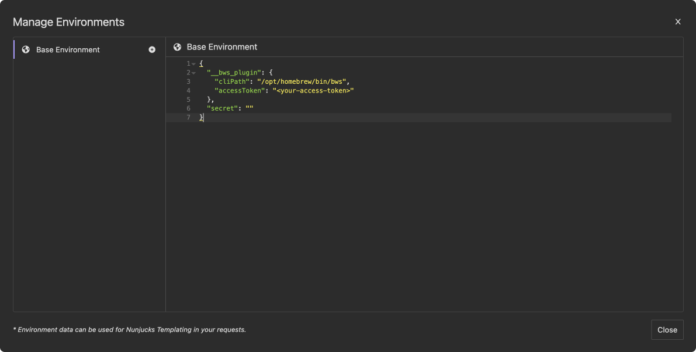

# Insomnia bws Plugin

This Insomnia plugin allows you to interact with the [Bitwarden Secrets Manager](https://bitwarden.com/products/secrets-manager/) (bws) CLI to perform operations such as retrieving secrets and projects.

## Requirements

[bws CLI](https://bitwarden.com/help/secrets-manager-cli/) installed on your system. You can install the CLI using the following commands:

### Installation

#### Linux and macOS
```sh
curl https://bws.bitwarden.com/install | sh` 
```

#### Windows

```powershell
iwr https://bws.bitwarden.com/install | iex
```

## Plugin Installation
In order for Insomnia to recognize the plugin as an Insomnia plugin, please copy the plugin files to the following locations:

| OS | Path |
| --- | --- |
| MacOS | `~/Library/Application Support/Insomnia/plugins/` (escaped version: `~/Library/Application\ Support/Insomnia/plugins/`) |
| Windows | `%APPDATA%\Insomnia\plugins\` |
| Linux | `$XDG_CONFIG_HOME/Insomnia/plugins/` or `~/.config/Insomnia/plugins/` |

## Plugin Configuration

The plugin requires you to set the bws CLI path and [access token](https://bitwarden.com/help/access-tokens/) in the environment variables. 



Below is an example configuration:

```json
{
  "__bws_plugin": {
    "cliPath": "/usr/local/bin/bws",
    "accessToken": "<your-access-token>"
  },
  "secret": ""
}
``` 

-   `cliPath`: Path to the bws CLI executable.
-   `accessToken`: Your Bitwarden access token.

## Usage

### Get Secret
> [!NOTE]  
> Instead of manually typing the template tags, you can use the [autocomplete menu](https://docs.insomnia.rest/insomnia/environment-variables#referencing-environment-variables) to insert them. Press `Ctrl + Space` wherever environment variables can be used to launch the autocomplete menu and select the desired bws operation.
> 
> 

To retrieve a secret by its UUID, use the following template tag in your Insomnia request:

```json
""
```

## Contributing

If you find any issues or have suggestions for improvements, feel free to open an issue or submit a pull request.

## License

This project is licensed under the [MIT License](https://github.com/maxkpower/insomnia-bitwarden-secrets/blob/main/LICENSE).

## Acknowledgement

- Massive thanks to [@jansgescheit](https://github.com/jansgescheit) for coming up with the idea and testing the plugin!